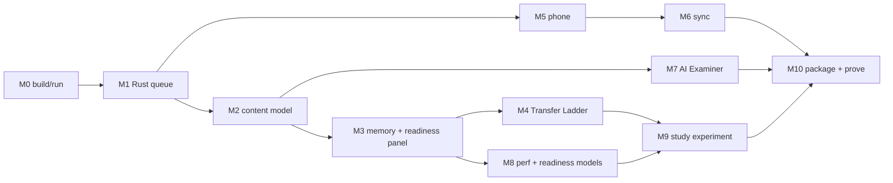

# Development Plan — Speedrun for the RPCE

How we build the app defined in [`PRD.md`](./PRD.md), in the order the spec
([`spec.txt`](./spec.txt) §6) demands: **make the apps work → add AI → prove it.**
Each milestone lists its spec/PRD anchor, the work, and the proof artifact.

> **Reality check.** This is a multi-session build. The forked desktop app
> compiles and runs today (M0). The RPCE-specific features (M1+) are layered on
> top incrementally. The phone companion (M5) needs a separate AnkiDroid project
>
> - Android SDK and is the largest external dependency. Milestones are tagged
>   **[done]**, **[in progress]**, or **[todo]** as we go.

---

## Guiding constraints (from spec §2, non-negotiable)

- A **real change inside Anki's Rust core** (not just Python screens).
- **Two apps, one shared engine**, with reviews syncing both ways.
- **Three separate scores** (memory, performance, readiness), each with a range.
- **Held-out, re-runnable** model testing.
- **One study feature**, tested by turning it off and on.
- **Every AI output** is source-traced, eval-checked, and beats a baseline.
- The app **abstains** when it lacks data.
- **Installable desktop + phone builds** that both run with **AI off**.
- License: **AGPL-3.0-or-later**, credit to Anki.

---

## Milestones

### M0 — Forked desktop app builds & runs · spec §6 (Wed), "Get Anki Building First"

- **Work:** verify the fork compiles from source on this machine; launch the desktop app; confirm a review loop on a deck.
- **Proof:** running app + commit hash. Build via `tools\ninja pylib qt` then `.\run.bat` (no `just` yet on this box).
- **Status:** **[done]** — builds and launches (Anki 26.05, mediasrv on `127.0.0.1:40000`).

### M1 — Rust engine change: Points-at-Stake Queue · spec §7a, PRD §7.5

- **Work:** new review order in `rslib` sorting due cards by `domain exam-weight × student weakness`; new protobuf message in `proto/`; expose via `_backend.py`; consume in the desktop queue.
- **Tests:** ≥3 Rust unit tests + 1 Python-calling test; undo works; no collection corruption.
- **Deliverables:** one-page "why Rust" note + list of touched upstream files (merge difficulty).
- **Proof:** the diff, green tests, a review session ordered by the new queue.
- **Status:** **[done]** — `get_points_at_stake_queue` RPC implemented in `rslib`; 6 Rust unit tests + 2 Python-calling tests pass; clippy clean; read-only so undo-safe. See [`RUST_CHANGE.md`](./RUST_CHANGE.md).

### M2 — RPCE content model · PRD §11b, spec §7c

- **Work:** add custom tables (`domains`, `card_topic`, `performance_items`, `attempts`, `coverage`, `readiness_snapshots`, `ai_outputs`) in the collection DB so they sync; seed the seven Performance-Expectation domains with exam weights; build/import the RPCE deck and tag each card to a domain.
- **Proof:** coverage map over all seven domains rendered on the dashboard.
- **Status:** **[done]** — implemented sync-safe via native **tags** (`rpce::domain::N`) + **collection config** weights instead of custom tables (Anki sync would not carry custom tables). `anki.rpce` module: 7 domains, `topic_weights`, `coverage`, `build_starter_deck`; 4 tests pass and feed the M1 queue.

### M3 — Memory score + Honest Readiness Panel (abstain) · spec §4, §9 Step 1, PRD §7.4, §8

- **Work:** calibrated memory score from FSRS/`revlog`; Svelte dashboard showing three score slots each with a range, evidence, coverage %, "how sure", last-updated; **abstain** below the give-up line.
- **Proof:** calibration chart + Brier/log-loss on held-out reviews; abstain state visible until thresholds met.
- **Status:** **[partial]** — scoring + honesty logic done in `anki.rpce.scores` (memory/performance/readiness with ranges, give-up/abstain rule, best-next-topic); 4 tests pass. Remaining: Svelte dashboard UI + FSRS-calibrated memory (Brier/log-loss).

### M4 — Transfer Ladder (study feature) · SPOV 1, PRD §7.1

- **Work:** per-concept format rotation (cloze → applied MCQ → free-text scenario → advising) layered on FSRS due-ordering via `paraphrase_group`/`format_rung`.
- **Proof:** a concept resurfaces in a different format; data recorded for the M9 experiment.
- **Status:** **[partial]** — ladder logic done in `anki.rpce.transfer_ladder` (rung order, advance/hold/drop, recommended rung, no-repeat); 6 tests pass. Remaining: wire rung selection into the reviewer UI + record `format_rung` on attempts.

### M5 — Phone companion (Android) · spec §3, §6 (Wed mobile)

- **Work:** AnkiDroid-based app reusing the shared Rust core (build native libs for Android targets); load the RPCE deck; run a real review on the shared engine.
- **Proof:** screen recording of a review session on a device/emulator.

### M6 — Two-way sync + conflict rule · spec §3, §7b, §6 (Fri)

- **Work:** self-hosted Anki sync server; both apps sync; documented higher-`usn`/last-writer conflict rule.
- **Proof:** 10 phone + 10 desktop offline reviews reconcile to 20 (none lost/doubled); same-card conflict resolves correctly.

### M7 — AI Examiner + safety · spec §6 (Fri), §7e, §7f, PRD §7.3, §9

- **Work:** grade Section II free-text **for accuracy** (no candidate citations required) with retrieval over `data/roberts_rules_of_order_12th_edition.md`; every AI reply cites that text or abstains; AI-off fallback.
- **Tests:** gold set (≥50 from `data/RPCE-Sample-Questions-v4-100625.md`) with pre-set cutoff; beats keyword/vector baseline; leakage scanner clean.
- **Proof:** eval numbers + baseline side-by-side; app still scores with AI off.

### M8 — Performance & readiness models · spec §4, §9 Steps 2–3, §7d, PRD §8

- **Work:** performance model P(correct on new item) from mastery/difficulty/timing/coverage; readiness = P(pass each section ≥80%) with range; paraphrase test.
- **Proof:** held-out accuracy + reported paraphrase gap; readiness range with confidence.

### M9 — Study-feature experiment · spec §8, PRD §9

- **Work:** three builds at equal study time — full (rotation on) / ablation (rotation off) / plain Anki; pre-state the metric.
- **Proof:** fair 3-way comparison with a range; null results reported honestly.

### M10 — Packaging, benchmarks & robustness · spec §6 (Sun), §7g, §7h, §10, PRD §14

- **Work:** desktop installer (Briefcase/`tools\build-installer`) + signed Android APK; one-command `bench`; crash/offline tests.
- **Proof:** clean-device install recordings for both; p50/p95/worst-case numbers; zero corrupted collections in the crash test.

---

## Sequencing & dependencies

---

## Working agreement

- **Commit after each meaningful step** (conventional commits).
- **Run checks before marking a milestone done:** `tools\ninja check` (or `just check` once installed); language-specific `test-rust` / `test-py` / `test-ts`.
- **Keep docs current:** update [`DEPLOYMENT.md`](./DEPLOYMENT.md) and the PRD whenever behavior changes.
- **No copyrighted source / secrets / personal data** committed (PDFs and `data/` stay gitignored).
- **Flag spec gaps:** if something can't meet a spec requirement, note it rather than fake it.
