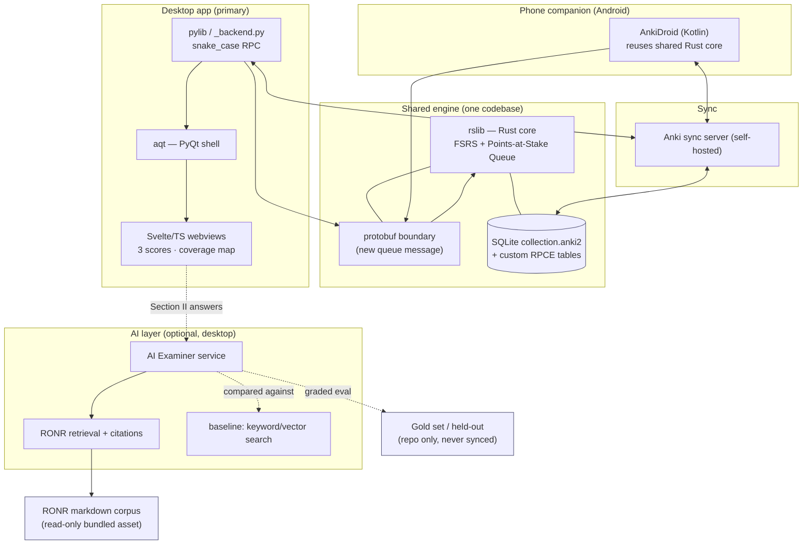

# Product Requirements Document — "Speedrun for the RPCE"

**A desktop + mobile study app, forked from Anki, for one graduate-level exam: the NAP Registered Parliamentarian Credentialing Exam (RPCE).**

| | |
| --- | --- |
| **Owner** | Project owner |
| **Status** | Draft v2 (detailed MVP definition) |
| **Exam (locked)** | RPCE — NAP Registered Parliamentarian Credentialing Exam |
| **License** | AGPL-3.0-or-later, with credit to Anki (Ankitects). Some upstream parts are BSD-3-Clause. |
| **Source corpus** | *Robert's Rules of Order Newly Revised, 12th ed.* (RONR) + NAP RP Performance Expectations + Joint Code of Professional Responsibility |
| **Spec** | [`spec.txt`](./spec.txt) (authoritative) · research in [`rpce_brainlift.md`](./rpce_brainlift.md) |

---

## 1. Summary

Speedrun is not "another flashcard app." A credentialing exam asks for more than memory: a
candidate must **apply** rules to scenarios they have never seen, work **fast enough** under a
hard time limit, and honestly know **whether they are ready**. We fork Anki so the product
inherits Anki's proven memory engine (FSRS) and its shared Rust core, then build the two harder
bridges the spec demands (spec §1, §4): **memory → performance** (answering new questions) and
**performance → readiness** (a calibrated pass-probability *with a range*, not a guess in a nice
font).

We pick **one** exam and build the whole product for it: the **RPCE** (spec §5). The RPCE is
uniquely well-suited to this thesis because it is *already split into the two halves we must model*:

- **Section I** — 100 multiple-choice questions, 3 hours, auto-scored. → maps to **spaced retrieval** (memory + applied MCQ performance).
- **Section II** — written performance scenarios, 3 hours, scored by trained examiners. → maps to **scenario + AI examiner debrief** (applied performance).
- A candidate must score **80% on *each* section independently** (proctored via ExamSoft/Examplify).

Because the exam is pass/per-section (not a scaled score — analogous to USMLE Step 1 in spec §5),
**readiness is modeled as a probability of clearing the 80% bar on *each* section** — never an
invented point score.

**The honesty rule (hard requirement, spec §1 & §4).** Speedrun may not show a readiness number
unless it also shows: the evidence behind it, what data is still missing, how accurate past
predictions were, the *range* of likely outcomes, the percent of the exam covered, when it was
last updated, and the single best next thing to study. A confident number with none of that
behind it is an automatic fail (spec §11).

---

## 2. Problems We Solve (and the evidence behind them)

Grounded in the RPCE BrainLift research insights:

1. **The "simulation vs. flashcards" false binary (Insight 1).** Existing prep picks one. Flashcards build durable recall but not applied judgment; simulation builds judgment but decays without spaced re-exposure. **We build a hybrid** whose two modes mirror the two exam sections.
2. **Recall practice breeds false mastery (SPOV 1).** Drilling one question format trains pattern-matching to the *format*, not the *concept*. A real meeting never presents a rule in the tidy shape a flashcard did. **We rotate formats** over the same content to force transfer.
3. **Feedback is the active ingredient (Insight 4).** Simulation *with* debrief beats simulation alone; the incumbent's feedback is delayed and instructor-mediated. **We give immediate, per-item AI debrief.**
4. **The AI should be an examiner, not a tutor (SPOV 3).** Candidates already passed the RONRIB membership exam and the corpus (RONR 12th ed.) is closed and citable. An AI inventing facts is actively harmful (see NAPMobile's wrong answers). **The AI grades and probes Section II answers against the Performance Expectations and demands RONR citations** — it does not lecture facts.
5. **Nobody offers an honest readiness signal (Insight 10).** NAP has content but no adaptivity or readiness score; NAPMobile is a plain (sometimes wrong) quiz bank. **We show a calibrated readiness range with its evidence — and abstain when we lack data.**

---

## 3. Spiky POVs → Features (the product thesis)

The three Spiky Points of View from the BrainLift are the backbone of the product. Each maps to a
**named, testable feature** in the MVP.

| Spiky POV | What it claims | Feature that embodies it | How we prove it |
| --- | --- | --- | --- |
| **SPOV 1 — Consistency is a trap.** Practicing one format breeds false mastery; vary the format even for the same content. | Mastery = transferring one idea across *different* contexts, exactly what Section I vs. Section II demand. | **Transfer Ladder** (§7.1): each concept resurfaces in escalating formats — cloze recall → applied MCQ → free-text scenario → advising prompt — never the same shape twice in a row. | **Paraphrase test** (spec §7d): 30 cards × 2 reworded questions; report the recall-vs-reworded gap. This is also the gated study-feature experiment (§9). |
| **SPOV 2 — One method is never enough.** Combine methods; each builds a different skill. | Recall fights decay (Section I); simulation builds applied competence (Section II); only together do they cover the exam. | **Dual-Mode Hybrid Engine** (§7.2): spaced-retrieval mode for Section I + scenario-simulation mode for Section II, with **scaffolding that fades** (worked examples → reflection) as mastery grows (Insight 3). | Both modes ship in MVP; coverage map proves both halves are exercised; ablation build turns the hybrid down to recall-only. |
| **SPOV 3 — The AI is an examiner, not a tutor.** High-prior-knowledge candidates need grading + reflection, not fact-lectures; an inventing AI is harmful. | The hard skill is *application + citation*; the closed RONR corpus makes grading verifiable. | **AI Examiner** (§7.3): grades Section II free-text against the seven Performance Expectations, demands an RONR citation, probes the reasoning, and **refuses to teach new facts**. Every output is source-traced. | Gold-set eval + wrong-answer rate vs. cutoff; beats keyword/vector baseline; leakage scan clean (spec §7e, §7f). |

A fourth, cross-cutting feature carries the **honesty rule** and the **Rust requirement**:

| Requirement | Feature | Notes |
| --- | --- | --- |
| Honest readiness (spec §1, §4) | **Honest Readiness Panel** (§7.4) | Three scores, each with a range, evidence, coverage %, "how sure", last-updated, best-next-topic, and an **abstain** state below the give-up line. |
| Real Rust engine change (spec §7a) | **Points-at-Stake Queue** (§7.5) | New review order sorting due cards by `domain exam-weight × student weakness`, in `rslib`, exposed via a new protobuf message, callable from Python, shipped to phone too. |

---

## 4. User Persona (start niche)

We deliberately start with **one** narrow user, not "test-prep students" in general.

### Primary persona — "the working-adult RP candidate"

- **Who:** A 30–55-year-old working professional embedded in a governance setting — association staff, an HOA/union/church board officer, or an attorney who advises boards.
- **Prior knowledge:** **Medium.** The candidate has *already passed* the NAP membership (RONRIB) exam, so they know the basics but need *more specifics and application/reflection*, not more worked examples (Insight 3).
- **Goal:** Pass **both** RPCE sections (≥80% each) within a quarterly window, while holding a full-time job — so they study in two places: at a desk in the evening and **on their phone between meetings**.
- **Pain today:** Lecture/cohort prep is scheduled and passive; the official app is a flat quiz bank with occasional wrong answers; no tool tells them honestly whether they are ready or which domain is their weakest.
- **Definition of success:** "I know my real weak spot today, I can practice Section II scenarios and get graded like an examiner would, and the app tells me — with a confidence range — when I'm actually ready, instead of guessing."

### Secondary / later personas (not the MVP focus)

- A PRP candidate (next credential up) reusing the simulation engine — *future*; validates lifecycle but out of MVP scope.
- A board member who only wants to run meetings (the commercial-course audience) — *explicitly not us*; they want basic motions, not exam rigor.

---

## 5. User Stories

### 5a. Stories we ARE focused on (MVP)

- As **the candidate**, I want to **review RPCE flashcards scheduled by spaced repetition** so that **I retain RONR facts without re-studying everything every night.**
- As **the candidate**, I want the **same fact to resurface in different formats** (recall, applied MCQ, scenario) so that **I prove I can apply it, not just recognize the wording.**
- As **the candidate**, I want to **answer free-text Section II scenarios and get immediate, examiner-style feedback with RONR citations** so that **I learn to justify rulings the way the graders expect.**
- As **the candidate**, I want to **see three separate scores — memory, performance, readiness — each with a range** so that **I'm not misled by a single blended number.**
- As **the candidate**, I want the app to **refuse to show a readiness score until it has enough data** so that **I trust it when it finally does.**
- As **the candidate**, I want a **coverage map of all seven Performance Expectation domains** so that **I can see which high-weight domain I've barely touched.**
- As **the candidate**, I want to **review on my phone offline, then sync to my desktop** so that **I can study between meetings and pick up where I left off at my desk.**
- As **the candidate**, I want **timed practice that mirrors the 3-hour limit** so that **I build pacing, not just untimed knowledge.**

### 5b. Stories we are NOT focused on (out of scope for MVP)

- As a casual user, I want to learn the *basics* of running a meeting. *(Wrong audience — that's the commercial-course market.)*
- As a candidate, I want the app to *take the proctored exam for me* or integrate with ExamSoft. *(Not possible/allowed; Examplify is a locked-down environment.)*
- As a candidate, I want a single "78% ready" gamified number. *(Banned by the honesty rule.)*
- As a user, I want AI to *teach me new parliamentary facts conversationally.* *(The AI is an examiner, not a tutor.)*
- As a PRP candidate, I want the two-day live-simulation exam modeled. *(Future.)*

---

## 6. MVP Definition

The MVP is sequenced to the spec's deadlines (spec §6): **make the apps work → add AI → prove it.**
No AI ships before the apps review the same deck on a shared engine.

### 6a. In scope (MVP) — by capability

**Engine & platforms**

- Forked Anki building from source (AGPL-3.0-or-later, credit to Anki).
- **One real change inside Anki's Rust core** (not just Python screens): the **Points-at-Stake Queue** (§7.5). Ships with ≥3 Rust unit tests + 1 Python-calling test, undo-safe, no collection corruption, and a one-page "why Rust" note plus a touched-upstream-files list (spec §7a).
- **Desktop app** (Anki's Python/Qt + Svelte) running a review loop on the RPCE deck.
- **Phone companion** that builds and runs on a real device/emulator, loads the RPCE deck, runs real reviews on the *shared* Rust engine, and **two-way syncs** with desktop (offline → reconnect, no lost/double-counted reviews; documented conflict rule — spec §7b).

**Learning content**

- RPCE deck mapped to the **seven Performance Expectation domains**, each card tagged to a domain (and, where possible, a specific PE).
- **Transfer Ladder** format rotation for each concept: cloze recall, applied MCQ, free-text scenario, advising prompt (§7.1).
- **Section II scenario practice** with **AI Examiner** grading against the Performance Expectations, demanding RONR citations, with immediate debrief (§7.3).

**The three scores (each with a range + give-up rule)** — §8

- **Memory:** P(recall a taught fact now) — from FSRS, **calibrated** (calibration chart + Brier/log-loss on held-out reviews).
- **Performance:** P(correct on a *new* exam-style item), incl. unseen ones (uses topic mastery, item difficulty, timing, coverage).
- **Readiness:** **P(pass each section ≥80%)** with a likely range and a confidence note — pass-probability framing, *no invented scaled score*.
- **Give-up rule (stated):** *No readiness shown until ≥200 graded reviews, ≥50% domain coverage across all seven domains, and ≥10 graded Section II scenarios.* Below the line, the app abstains.

**AI safety & evidence** — §9

- Every AI output traces to a **named source** (an RONR 12th-ed. citation / a Performance Expectation / the Joint Code section).
- **Pre-release eval** on a held-out gold set (≥50 Q&A pairs): accuracy + wrong-answer rate, with a cutoff set *before* looking.
- **Beats a baseline** (keyword or vector search over the RONR corpus) shown side-by-side.
- **Leakage check** script: flags any test item (or near-copy) that slipped into training data.
- **AI-off mode:** both apps still give a score with AI switched off.

**One study feature, tested (spec §8)** — §9

- **Hypothesis:** *"Rotating question format over the same content (Transfer Ladder) raises accuracy on new, reworded scenario questions at equal study time, vs. repeating a single format."*
- Tested with three builds at equal study time: full app (rotation on) / ablation (rotation off) / plain unmodified Anki. Main metric stated ahead of time; range reported; null results reported honestly.

**Packaging**

- Desktop installer that runs on a clean machine; signed phone build (APK / TestFlight or sideload). Both run with AI off.

### 6b. Out of scope (MVP)

- ExamSoft/Examplify integration or any proctoring.
- The PRP two-day live simulation; voice/real-time multi-user mock meetings.
- AI-generated *new* study content shipped to users without passing the gold-set checker.
- Native rewrite of the scheduler in JS/Swift (spec forbids it — must share the Rust engine).
- A scaled/blended single readiness number.
- Real-student score-validation against actual practice-test outcomes (spec §9 Step 4 "bonus" only — we grade the *bridge*, not a made-up final number).

### 6c. MVP acceptance checklist (maps to spec deadlines)

| Deadline | Must demonstrate | Proof artifact |
| --- | --- | --- |
| **Wednesday** (spec §6) | Both apps review the same deck on the shared engine, **no AI**; Rust change works end-to-end; memory score with range + give-up rule; clean-machine installer; phone runs a real review. | Commit hash, clean-build recording, Rust+Python test output, install recording, phone review recording. |
| **Friday** (spec §6) | AI Examiner added + source-traced; gold-set eval with cutoff; beats baseline; **two-way phone↔desktop sync**; offline-then-sync; phone shows three scores + give-up rule; app still scores with AI off. | Eval numbers, baseline side-by-side, phone→desktop sync recording. |
| **Sunday** (spec §6) | Calibrated memory model (chart + Brier/log-loss); performance accuracy on held-out items + paraphrase gap; readiness method + range; 3-way study-feature test; conflict-resolution demo; packaged installers for both; AI-off still scores. | Results report, model one-pagers, BrainLift, clean-device install recordings, `just bench` numbers. |

---

## 7. Feature Specifications

### 7.1 Transfer Ladder (SPOV 1)

**Goal.** Defeat false mastery by never letting a concept be practiced in the same format twice in a row.

- **Concept grouping.** Items that test the same idea share a `paraphrase_group` (see §11). A "concept" is one row in the RP blueprint at PE granularity.
- **Format ladder (escalating).** `cloze recall → applied MCQ → free-text scenario → advising prompt`. As a concept's mastery rises, the scheduler prefers a *higher rung* than last time; on a lapse it can drop a rung (scaffolding fade, Insight 3).
- **Scheduling hook.** Rung selection is layered on top of FSRS due-ordering — FSRS decides *when* a concept is due; the Transfer Ladder decides *which format* surfaces. FSRS intervals stay valid.
- **Measurement.** The recall-vs-reworded gap (paraphrase test, spec §7d) is the success metric; a near-zero gap would mean the performance model just mirrors memory.

### 7.2 Dual-Mode Hybrid Engine (SPOV 2)

**Goal.** Mirror the exam's two halves with two complementary practice modes on one engine.

- **Section I mode — spaced retrieval.** Standard Anki review loop over MCQ/cloze cards, scheduled by FSRS and re-ordered by the Points-at-Stake Queue (§7.5).
- **Section II mode — scenario simulation + debrief.** Free-text scenario prompts graded by the AI Examiner (§7.3); the *debrief* is the active ingredient (Insight 4).
- **Scaffolding fade (Insight 3).** Early on, scenarios offer worked-example structure (model ruling + citation shown after attempt); as mastery rises, support fades to reflection-only prompts ("justify your ruling; cite RONR").
- **Shared substrate.** Both modes write `attempts` (§11) into the same collection DB, so memory/performance/readiness draw from one history and sync across devices.

### 7.3 AI Examiner (SPOV 3)

**Goal.** Grade and probe Section II answers like a trained examiner; never lecture facts.

- **Inputs.** Candidate free-text answer + the scenario's `gold_answer`/rubric + the relevant Performance Expectation(s) + retrieved RONR passages.
- **Outputs.** A 0–5 rubric score, targeted debrief, a required **RONR citation** for the correct ruling, and probing follow-up questions — **no new factual lecture** (the candidate is presumed to know the basics).
- **Grounding & safety.** Retrieval over the RONR markdown corpus; every output carries a `source_citation` (§11). If retrieval finds no supporting passage, the Examiner abstains rather than inventing (anti-NAPMobile rule).
- **AI-off fallback.** With AI disabled, Section II falls back to self-scoring against the shown rubric; the app still produces all three scores (spec §6, §11).

### 7.4 Honest Readiness Panel (honesty rule)

**Goal.** Make every number defensible or absent.

- **Per section (I and II)** show: point P(pass ≥80%), likely range, % exam covered, "how sure" (abstain/low/medium/high), last-updated timestamp, top reasons, and the single best next topic.
- **Abstain state.** Below the give-up line (§6a), the panel shows *what data is missing* and the action to unlock a score — never a placeholder number.
- **Auditability.** Every computation is written to `readiness_snapshots` (§11) so past predictions can be scored for accuracy later.

### 7.5 Points-at-Stake Queue (Rust change, spec §7a)

**Goal.** Make the highest-value cards come first, in the shared Rust engine.

- **Order.** Sort due cards by `domain exam-weight × student weakness`, where weakness derives from FSRS retrievability and recent `attempts`.
- **Surface.** New protobuf message + backend call in `rslib`; `_backend.py` exposes a snake_case method; the desktop queue and dashboard consume it.
- **Guarantees.** ≥3 Rust unit tests + 1 Python-calling test; undo works; no collection corruption (crash test, spec §7g); ships unchanged to the phone build.
- **Why Rust (one-pager, spec §7a).** Lives below the protobuf boundary so desktop and phone share it; touches scheduling hot paths that must hit the speed targets (§10); avoids a JS/Swift fork the spec forbids.

---

## 8. The Three Scores (models)

| Score | Question (spec §4) | Method | Honesty artifacts |
| --- | --- | --- | --- |
| **Memory** | "Can the candidate recall a taught fact now?" | FSRS retrievability, **calibrated** on held-out reviews. | Calibration chart + Brier/log-loss (spec §9 Step 1). |
| **Performance** | "Can they answer a *new* exam-style item?" | Model over topic mastery, item difficulty, response latency, and coverage; predicts P(correct) on held-out items. | Held-out accuracy + **paraphrase gap** (spec §7d, §9 Step 2). |
| **Readiness** | "What's the chance they clear 80% on each section?" | Aggregate performance × coverage into **P(pass ≥80%) per section** with a range; **no scaled score** (RPCE is pass/section). | Range + confidence + coverage + evidence + abstain (spec §4, §9 Step 3). |

**Give-up rule (restated).** No readiness until ≥200 graded reviews, ≥50% coverage across all seven
domains, and ≥10 graded Section II scenarios. The app abstains below this line and says why.

---

## 9. AI Safety, Evals & the Study-Feature Experiment

**AI safety (spec §6, §7e, §7f).**

- **Source-traced:** every AI output names an RONR / PE / Joint-Code source or abstains.
- **Gold set:** ≥50 Q&A pairs with known-correct answers; pre-set pass cutoff; report correct / wrong / "correct-but-bad-teaching" counts; block failing cards.
- **Baseline:** keyword or vector search over RONR, shown side-by-side; the AI must beat it.
- **Leakage scanner:** flags any test/gold item (or near-copy) that slipped into prompts/training; a violation zeroes that score (spec §11).

**Study-feature experiment (spec §8) — the Transfer Ladder.**

- **Hypothesis (stated up front):** rotating format over the same content raises accuracy on new, reworded scenario questions at equal study time.
- **Three builds, equal study time, same learners & questions:** full app (rotation on) / ablation (rotation off) / plain unmodified Anki.
- **Main metric (pre-stated):** reworded-question accuracy gap. Report a range; report null results honestly ("no difference" is a valid result).

---

## 10. Architecture

Speedrun is a fork of Anki: one **Rust core** (`rslib`) behind a **protobuf** boundary, embedded
by a **Python/Qt + Svelte** desktop app and an **Android (Kotlin)** companion, with an optional
**AI service** layered on the desktop and a **sync server** keeping devices in step. The diagram
below is authored in Mermaid (YAML-style declarative text for architecture diagrams).



**Data-flow notes.**

- The **Rust change ships once** and runs on both desktop and phone because it sits below the protobuf boundary.
- **Reviews from either device** flow through the sync server into the same collection; the documented conflict rule (higher-`usn` / last-writer) resolves same-card-offline edits (spec §7b).
- **AI is desktop-only and optional**; with it off, both apps still compute all three scores.
- **Gold/held-out data lives in the repo, never synced into prompts/training** — enforced by the leakage scanner.

---

## 11. Tech Stack & Data Schema

### 11a. Tech stack

- **Core engine:** Anki's **Rust** backend (`rslib`), forked. The Points-at-Stake Queue lives here so it ships to **both** desktop and phone. Protobuf for the Rust↔client boundary.
- **Desktop client:** Anki's **Python + PyQt (aqt)** shell with **Svelte/TypeScript** webviews for dashboards (three scores, coverage map).
- **Mobile client:** **AnkiDroid** (Kotlin, AGPL) for Android, reusing the shared Rust backend; **iOS** via Anki's Rust C-interface (FFI) is *future*. MVP targets Android first.
- **Sync:** self-hosted **Anki sync server** (HTTP); documented last-writer / higher-`usn` conflict rule for the same-card-offline case (spec §7b).
- **Local storage:** **SQLite** — Anki's `collection.anki2` on each device, plus our custom tables (§11b).
- **AI layer:** an LLM API (examiner grading + scenario debrief) behind a thin service, with **retrieval over the RONR markdown corpus** for citation grounding. **Baseline** = keyword/vector search for the side-by-side. All AI is **optional** (app fully works AI-off).
- **Source corpus pipeline:** existing Python converters (`convert_ronr.py`, `convert_rpce.py`) using `pymupdf` → faithful Markdown + rendered rubric images. *Source PDFs are copyrighted and stay out of version control.*
- **Quality:** Rust unit tests + Python integration test for the engine change; held-out eval harness (re-runnable, deterministic seed); leakage scanner; **linters** (`ruff` for Python, Anki's `./ninja format`/`fix`, `cargo clippy`) wired into CI.

### 11b. Data schema

**Where it lives:** each device holds a local **SQLite** collection (`collection.anki2`); changes
sync via the Anki sync server. The **RONR corpus** ships as a read-only bundled asset (Markdown +
images). **Eval/gold sets and held-out reviews live in the repo, never synced into the trained
model** (enforced by the leakage check).

**Reused Anki tables (unchanged):** `notes`, `cards`, `notetypes`, `decks` (content + FSRS
fields); `revlog` (review log — raw material for the memory model + calibration); `col` / `graves`
(config, deletions for sync).

**New tables (our additions; live in the same collection DB so they sync):**

```text
domains
  id              INTEGER PK            -- 1..7 (the seven Performance Expectations)
  name            TEXT                  -- e.g. "Subsidiary and Privileged Motions"
  exam_weight     REAL                  -- share of the exam blueprint (sums to 1.0)

card_topic                              -- maps Anki cards/notes to a domain (+ optional PE)
  note_id         INTEGER FK -> notes
  domain_id       INTEGER FK -> domains
  pe_code         TEXT NULL             -- finer Performance-Expectation tag

performance_items                       -- exam-style MCQ + Section II scenario prompts
  id              INTEGER PK
  domain_id       INTEGER FK -> domains
  kind            TEXT                  -- 'mcq' | 'scenario' | 'professional_responsibility'
  prompt          TEXT
  gold_answer     TEXT                  -- correct answer / model rubric
  ronr_citation   TEXT                  -- e.g. "RONR (12th ed.) 12:70-71" (source-of-truth)
  paraphrase_group INTEGER NULL         -- items sharing the same idea (Transfer Ladder + paraphrase test)
  split           TEXT                  -- 'train' | 'heldout' | 'gold'  (leakage control)

attempts                                -- every graded answer the student gives
  id              INTEGER PK
  item_id         INTEGER FK -> performance_items NULL   -- null if a plain card review
  card_id         INTEGER FK -> cards NULL
  format_rung     TEXT                  -- 'cloze' | 'mcq' | 'scenario' | 'advising' (Transfer Ladder)
  response        TEXT
  correct         INTEGER               -- 0/1 for MCQ
  ai_score        REAL NULL             -- 0..5 examiner score for scenarios
  ai_feedback     TEXT NULL
  latency_ms      INTEGER               -- timing -> pacing signal
  ts              INTEGER               -- epoch ms

coverage                                -- derived per domain (cached for the dashboard)
  domain_id       INTEGER FK -> domains
  cards_present   INTEGER
  pct_covered     REAL                  -- vs. blueprint; drives the abstain rule

readiness_snapshots                     -- audit trail of every readiness computation
  id              INTEGER PK
  section         TEXT                  -- 'I' | 'II'
  p_pass          REAL NULL             -- P(>=80%); NULL when abstaining
  range_low       REAL NULL
  range_high      REAL NULL
  confidence      TEXT                  -- 'abstain' | 'low' | 'medium' | 'high'
  pct_covered     REAL
  evidence        TEXT                  -- top reasons / best-next-topic
  abstained       INTEGER               -- 1 if give-up rule triggered
  ts              INTEGER

ai_outputs                              -- traceability for every AI generation/grade
  id              INTEGER PK
  attempt_id      INTEGER FK -> attempts NULL
  source_citation TEXT                  -- named RONR / Joint-Code source (required)
  model           TEXT
  passed_eval     INTEGER               -- did it clear the gold-set cutoff?
  ts              INTEGER
```

**Notes on the design**

- `performance_items.split` + `paraphrase_group` directly enable the **paraphrase test** and the **leakage check** without extra plumbing.
- `attempts.format_rung` records which Transfer-Ladder rung produced an answer, so the study-feature experiment can compare formats directly.
- `readiness_snapshots` stores the *whole* honest payload (point, range, confidence, coverage, evidence, abstain flag) so the UI can always show "what produced this number," and so we can later measure how accurate past predictions were.
- `attempts.latency_ms` is what lets the performance/readiness models account for the **time-pressure** skill the RPCE specifically tests.

---

## 12. Domain Building (RPCE specifics that drive the product)

| Attribute | Value | Product implication |
| --- | --- | --- |
| Sections | Section I (100 MCQ, auto-scored) + Section II (written performance) | Two engine modes, scored independently |
| Pass bar | **80% on *each* section** | Readiness = two pass-probabilities, not one |
| Time | 3 hrs per section (7 hrs total, ≤1 hr break, upload ≤8 hrs) | Timed practice is a first-class feature |
| Domains | **7 Performance Expectations** (Main motions; Subsidiary/Privileged; Incidental & bring-again; Org/Conduct of meetings; Voting/Nominations/Elections; Professionalism/Teaching; Boards/Committees & Bylaws) | Coverage map + topic weights keyed to these 7 |
| Corpus | RONR 12th ed. (closed, citable) + Joint Code of Professional Responsibility | AI must cite; grounds the leakage/eval design |
| Candidate | Already passed RONRIB membership exam | Medium prior knowledge → specifics + reflection > worked examples |
| Cadence | Quarterly 7-day windows; RP renews every 2 years | Spaced retrieval extends usefulness past exam day |

---

## 13. Success Metrics

- **Engine:** Rust change works end-to-end on desktop *and* phone; all tests green; undo + crash tests show **zero corrupted collections** (spec §7g).
- **Sync:** 10 phone + 10 desktop offline reviews reconcile to 20, none lost/doubled; same-card conflict resolves to a documented, correct winner (spec §7b).
- **Memory model:** calibration chart + Brier/log-loss on held-out reviews (spec §9 Step 1).
- **Performance model:** accuracy on held-out exam-style items; reported **paraphrase gap** (spec §7d).
- **AI:** gold-set accuracy + wrong-answer rate above a pre-set cutoff; beats keyword/vector baseline; leakage scan clean (spec §7e, §7f).
- **Study feature:** fair 3-way comparison (on/ablation/plain Anki) at equal study time, with a pre-stated metric and honest reporting of null results (spec §8).
- **Performance targets (spec §10):** button-press ack p95 < 50 ms; next card p95 < 100 ms; dashboard first load p95 < 1 s; refresh p95 < 500 ms; sync < 5 s; cold start < 5 s desktop / < 4 s phone; nothing freezes the UI > 100 ms. Reported via a one-command benchmark (`just bench`) on a 50,000-card deck with p50/p95/worst-case (spec §7h).

---

## 14. Deployment & Distribution (how it ships as an app)

Both apps must **install and run on a clean device** and **still produce a score with AI off**
(spec §6 Sunday, §11 hard limit). Deployment reuses Anki's existing packaging toolchain rather
than inventing a new one.

### 14a. Desktop app

- **Build → package:** built from the forked source via the project's `just` recipes; packaged with Anki's **Briefcase-based installer** tooling (`qt/installer`, which already has `windows-template/`, `mac-template/`, `linux-template/`).
- **Artifacts (MVP target = Windows first):** a Windows installer (`.exe`/MSI) that runs on a machine with no dev tools; macOS `.dmg` and Linux build are stretch targets.
- **What's bundled:** the PyQt shell + Svelte webviews, the shared Rust core (compiled in), and the **read-only RONR markdown corpus + rubric images**. Copyrighted source PDFs are **never** bundled or committed — the corpus is regenerated locally by the converter pipeline.
- **AI configuration:** the LLM endpoint/key is read from local config/env at runtime, **never compiled into or shipped with the build**; absent a key, the app starts in AI-off mode and still scores.
- **First-run:** ships with (or downloads on first launch) the RPCE deck and the seven-domain mapping; no account required for local study.
- **Acceptance:** a screen recording of the installer running on a clean VM, launching, and completing a review with AI off (spec §6 proof).

### 14b. Phone companion (Android first)

- **Build → package:** built on **AnkiDroid** (Kotlin, AGPL) reusing the shared Rust core via the same protobuf boundary; produces a **signed APK** (the MVP deliverable; Play Store listing is optional/stretch).
- **Distribution:** signed APK for **sideload** install on a real device/emulator, or internal-track upload; **iOS via TestFlight is future** (iOS uses Anki's Rust C-FFI, out of MVP scope).
- **Offline-first:** the deck and engine run fully offline; reviews sync to desktop when a connection returns (§14c). AI features degrade cleanly to off when offline/rate-limited and the app keeps scoring (spec §7g).
- **Acceptance:** a recording of the signed APK installing and running a review on a clean device/emulator, and a reviewed card syncing to desktop (spec §6 proof).

### 14c. Sync & data deployment

- **Sync server:** a **self-hosted Anki sync server** (HTTP) is part of the deployment; either run locally for the demo or on a small instance. Devices point at it via config.
- **Conflict rule (documented):** same-card-offline edits resolve by higher-`usn` / last-writer; this rule is stated in the repo and demonstrated (spec §7b).
- **No secrets in artifacts or VCS:** API keys, sync credentials, and any personal data stay in local config/secret stores — never in installers, the repo, or the synced collection. The leakage scanner additionally keeps gold/held-out data out of anything shipped to the model.

### 14d. Release checklist (per build, before handing in)

- Clean-device install verified on desktop **and** phone; both launch and score **with AI switched off**.
- License compliance: AGPL-3.0-or-later notice + credit to Anki (Ankitects) included in the about/readme; BSD-3-Clause notices preserved for the relevant upstream parts (spec §11).
- Version/commit hash embedded so a build is traceable to a commit (spec §6 proof).
- `just bench` numbers captured on the 50,000-card deck (spec §7h, §10 targets) for the release.
- No copyrighted PDFs, keys, or personal information in the artifact or repo.

---

## 15. Key Risks & Mitigations

| Risk | Mitigation |
| --- | --- |
| Anki won't build / mobile build slips (spec's #1 day-one risk) | Get fork building + tiny Rust change + phone build working **before** any feature work. |
| AI invents parliamentary facts (NAPMobile failure mode) | AI is examiner-only, every output cites RONR or abstains; gold-set checker blocks failing cards. |
| Readiness looks confident but is a guess | Hard give-up rule + full evidence payload; pass-probability with range, never a scaled number. |
| Test data leaks into training | Automated leakage scanner; `split` column enforced; that score zeroes if violated. |
| Performance model just mirrors memory | Transfer Ladder + paraphrase test report the gap explicitly. |
| Copyrighted source material | PDFs + generated MD/images excluded from version control; regenerated locally. |

---

*Sources: project [`spec.txt`](./spec.txt); [`rpce_brainlift.md`](./rpce_brainlift.md) (SPOVs + Insights 1–10); `data/RPCE-Sample-Questions-v4-100625.md` (seven domains, Section II + professional-responsibility samples); `data/README.md` (corpus pipeline). Built on Anki by Ankitects — AGPL-3.0-or-later.*
